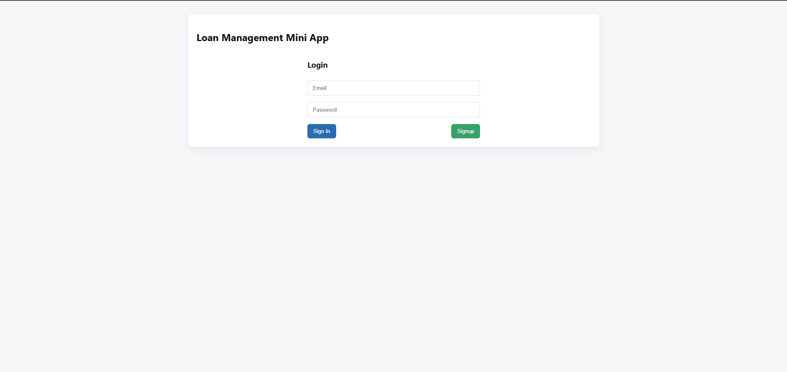
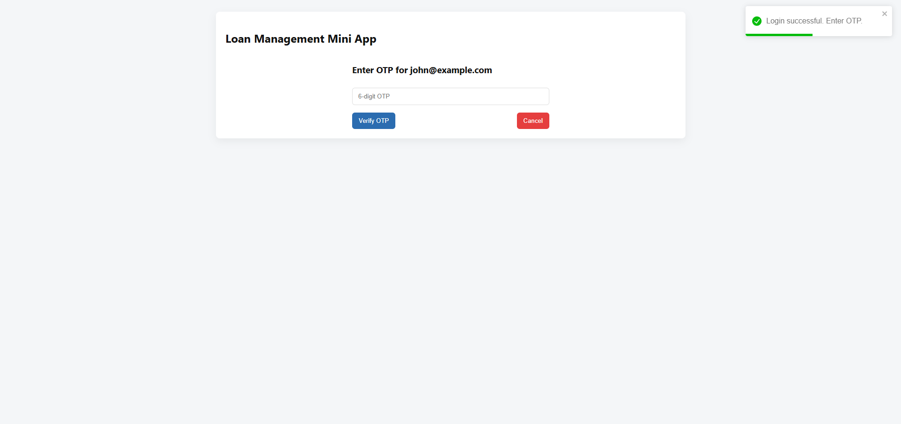
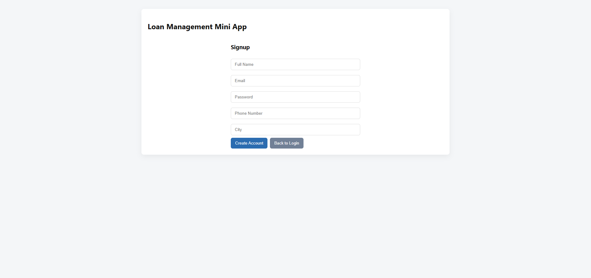

📌 Loan Management Mini App

A frontend-based loan management mini web application built using React.
The app demonstrates Login + OTP Authentication Flow, Signup, and a Dashboard displaying loan details.

🚀 Features
Module	Description
🔐 Login	User login using email + password
🔑 OTP Verification	Secondary OTP authentication before accessing the dashboard
📝 Signup	New user registration with validation
📊 Dashboard	Displays user-specific loan details after authentication
🔒 Protected Route	Dashboard accessible only after successful login
💾 Local Storage	All users and loan data stored locally (no backend required)
📂 File Structure (Overview)
src/
 ├─ components/
 │   ├─ Login.jsx
 │   ├─ OTP.jsx
 │   ├─ Signup.jsx
 │   ├─ Dashboard.jsx
 │   ├─ ProtectedRoute.jsx
 ├─ utils/
 │   ├─ storage.js
 ├─ App.jsx
 ├─ index.js

🛠️ Setup & Running Instructions
1️⃣ Clone the project
git clone https://github.com/your-repo/loan-management-mini-app.git
cd loan-management-mini-app

2️⃣ Install dependencies
npm install

3️⃣ Run the project
npm start

4️⃣ Access the app
http://localhost:3000

Page	Screenshot
Login	 

OTP	

Signup	

Dashboard	
🎯 Bonus Features Added

✔ Form Validations (Login / Signup / OTP)
✔ Auto-redirect:

If already logged in → /login redirects to /dashboard

If not logged in → /dashboard redirects to /login
✔ Alert/Toast Notifications (Success / Error)
✔ Mobile-friendly responsive UI

📌 Technology Stack
Category	Tech
Frontend	React, React Router, React Toastify
Storage	LocalStorage
Styling	CSS